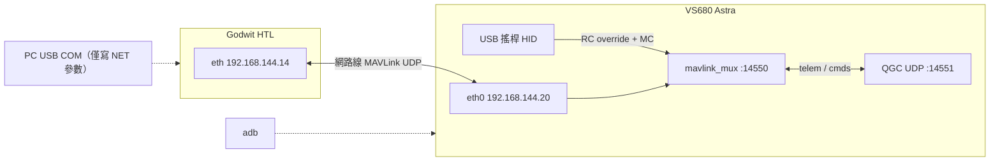

# 架構：VS680 QGC ↔ 實體無人機

> 更新：2026-07-31 · **唯一支援路徑 = eth0 + mavlink_mux（HTL）**

## 拓樸 — eth0 + mux（唯一路徑）



```
飛控 eth :* ↔ VS680 eth0:14550 (mux) ↔ QGC 127.0.0.1:14551   ← 遙測／Arm／Takeoff／RTL／Loiter…
搖桿 HID → mux 注入 RC_CHANNELS_OVERRIDE + MANUAL_CONTROL（離中位時）→ 飛控
```

一鍵 eth bring-up：[`../tool/bring-up/setup-eth-htl.ps1`](../tool/bring-up/setup-eth-htl.ps1)（預設開 QGC 聽 :14550）  
搖桿／飛行 UX：再跑 [`../tool/with-qgc/start-joy-direct.ps1`](../tool/with-qgc/start-joy-direct.ps1)（mux 佔 :14550，QGC 改 :14551）

**Option B mux — 職責分工：**
| 路徑 | 誰發 | 內容 |
|------|------|------|
| QGC → FC（經 mux 透明轉發） | QGC UI | Arm／Disarm、Takeoff、RTL、Loiter／Guided、任務、參數 |
| HID → FC（mux 注入） | 板端搖桿 | `RC_CHANNELS_OVERRIDE` + `MANUAL_CONTROL`（離中位才送；中位不送以免擋 QGC） |
| FC → QGC | mux 透明轉發 | 遙測／ACK／STATUSTEXT |

腳本會關閉 AutoConnect UDP、寫入 Comm Link `BoardMux14551`、`JoystickEnabled=false`。備援：`-Link usb`。

**硬性條件：** 測 eth 時 **關閉板端 Wi‑Fi**，否則 QGC 回包走 wlan0 → 參數下載半雙工失敗。

## 搖桿延遲（Done · 2026-07-31）

| 指標 | n | P50 | P95 | 說明 |
|------|---|-----|-----|------|
| L_cmd dense | 1000 | 5.3 ms | 56.2 ms | 每筆 mux send ↔ 最近 EV_ABS |
| L_cmd_edge | 22 | 8.7 ms | 17.9 ms | 猛推邊緣 → 首包 |

探針：`getevent -lt`（T0）+ mux `-L`（T1），同 CLOCK_MONOTONIC。  
報告：[`latency-report.html`](latency-report.html) · Evidence：[`../test/evidence/latency-mux-n1000-latest/`](../test/evidence/latency-mux-n1000-latest/)

## 已淘汰 — USB via PC（僅存證，2026-07-29）

> **不再使用。** 早期 Lab 驗證：PC COM → `mavlink-forward.py` → 板 Wi‑Fi UDP。  
> 證據：[`verification-report.md`](verification-report.md)、[`../test/evidence/20260729-qgc-connected/`](../test/evidence/20260729-qgc-connected/)  
> 腳本 `start-real-drone-forward.ps1` 保留但 **Deprecated**。

## 為何不是 adb reverse + TCP

| 嘗試 | 結果（2026-07-29） |
|------|---------------------|
| `adb reverse tcp:14550` + 本機 TCP bridge | QGC 預設 UDP → Disconnected |
| `adb reverse udp:` | adb **不支援** |
| eth0 直連 / `udpout:<board_ip>:14550` | **Pass** |

## HTL 注意

- `SIM_*`／模擬 IMU：實體六方位 Accel 校正常 **FAIL**
- Bench：`ARMING_CHECK=0` + 微小 `INS_ACCOFFS_*`（**拆槳**）；正式飛行勿用
- FC `NET_ENABLE` 預設 0 → 需一鍵或手動開啟

## 失敗模式

| 現象 | 處理 |
|------|------|
| 參數下載卡一半 | 關 Wi‑Fi；確認 eth 雙向 tcpdump |
| eth0 無 IPv4 | `setup-eth-htl` / `set-board-eth.ps1`；重開機後重設 |
| ping FC 失敗但 UDP 有 | 常見（FC 可不回 ICMP）；以 UDP 為準 |
| COM ClearCommError | 重插 USB；關掉佔用 COM 的程式 |
| Not Ready Accel | HTL 略過 arming 或換非 HTL 韌體再校正 |
