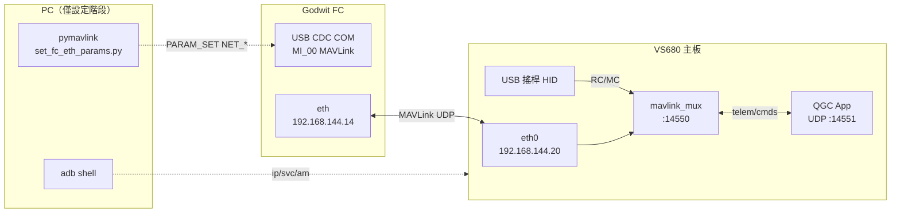

# 整合報告 — VS680 主板 ↔ Godwit FC（eth0 直連通訊）

> **日期**：2026-07-31  
> **來源**：專案 bring-up 文件 + session 討論整理（進度確認、遠端同步、通訊機制釐清）  
> **DUT**：VS680 `83bc469a34914114` · Godwit HTL · `AcctonGodwit_GA1`  
> **SSOT 操作**：[`../mux/操作手冊-Mux-HTL.md`](../mux/操作手冊-Mux-HTL.md) · 一鍵 [`../../tool/start-with-qgc.ps1`](../../tool/start-with-qgc.ps1) / eth [`../../tool/bring-up/setup-eth-htl.ps1`](../../tool/bring-up/setup-eth-htl.ps1)

---

## 1. 執行摘要

| 項目 | 狀態 |
|------|------|
| **唯一支援資料路徑** | VS680 **eth0** ↔ FC **Ethernet** · MAVLink **UDP :14550**（經 **`mavlink_mux`**） |
| **通訊驗證** | **Pass**（2026-07-30 eth HTL；見 [`verification-eth-htl-20260730.md`](verification-eth-htl-20260730.md)） |
| **搖桿路徑** | **Pass** — Option B mux 注入 RC/MC；QGC `:14551` 僅指令／遙測 |
| **延遲量測** | **Done** — L_cmd dense n=1000 · P50 5.3 ms（[`../latency/latency-report.html`](../latency/latency-report.html)） |
| **已淘汰路徑** | USB→PC→Wi‑Fi `mavlink-forward`（2026-07-29 存證；2026-07-31 標 Deprecated） |
| **待做** | `L_telem_qgc`（HUD）；中期空口後改 Baseline-Product |
| **遠端 repo** | 本地尚有 mux／latency 變更待 commit（以 `git status` 為準） |

**核心結論：** 板端與 FC 的日常通訊 **不是** Android shell 對 FC 下 cmd，而是 **MAVLink UDP 經 eth0**。飛行 UX 現行由 **`mavlink_mux`** 佔 `:14550`（搖桿注入 + 轉發），QGC 聽 `:14551`。PC USB 僅在 **首次／參數遺失** 時寫 `NET_*`。

---

## 2. 通訊拓樸（唯一路徑）



```
階段 1（一次性／維護）  PC USB COM ──MAVLink PARAM──→ FC（寫 NET_*）
階段 2（日常 eth）      FC eth .14 ←──網路線──→ 板 eth0 .20
階段 3（飛行 UX）       mux :14550 ↔ QGC :14551；搖桿 → mux → FC
```

| 連線 | 協定 | 用途 |
|------|------|------|
| FC eth ↔ 板 eth0 ↔ mux | MAVLink2 / UDP 14550 | **日常**遙測、參數、搖桿注入 |
| mux ↔ QGC | UDP 14551（loopback） | Arm／Takeoff／RTL／遙測顯示 |
| PC USB → FC | MAVLink / serial 115200 | **僅**寫 FC 參數、reboot |
| PC USB → 板（adb） | Android shell | 設 eth0 IP、關 Wi‑Fi、推 mux／QGC |
| 板 USB 搖桿 | HID → mux | `RC_CHANNELS_OVERRIDE` + `MANUAL_CONTROL` |

---

## 3. 兩階段 Bring-up 流程

### 3.1 階段一 — PC USB 設定 FC（ArduPilot `NET_*`）

**為何需要：** FC 預設 `NET_ENABLE=0`，eth 不會自動當 MAVLink 用。

**依據：**

1. ArduPilot 韌體內建 `NET_*` 參數（乙太網 + MAVLink 路由）
2. 2026-07-30 實測：`NET_ENABLE` 0→1、`NET_P1` UDP Client → 板 `:14550` 均 **Pass**
3. 實作：[`../../tool/bring-up/set_fc_eth_params.py`](../../tool/bring-up/set_fc_eth_params.py)

**寫入參數摘要：**

| 參數 | 值 | 意義 |
|------|-----|------|
| `NET_ENABLE` | 1 | 開啟 FC 乙太網 |
| `NET_DHCP` | 0 | 固定 IP |
| `NET_IPADDR*` | 192.168.144.14 | FC eth 位址 |
| `NET_NETMASK` | 24 | /24 子網 |
| `NET_P1_TYPE` | 1 | UDP Client |
| `NET_P1_IP*` | 192.168.144.20 | 目標 = 主板 eth0 |
| `NET_P1_PORT` | 14550 | QGC 監聽 port |
| `NET_P1_PROTOCOL` | 2 | MAVLink2 |

寫入後通常 **FC reboot** 才生效。Bench 可能另寫 `ARMING_CHECK=0`（**拆槳**）；正式飛行用 `-ProductionSafe` 跳過。

**「下參數」的方式：** 不是對 FC 下 Linux cmd，而是 pymavlink 送 MAVLink：

- 讀：`PARAM_REQUEST_READ` → 收 `PARAM_VALUE`
- 寫：`PARAM_SET` → 收 `PARAM_VALUE` ACK
- 重開：`MAV_CMD_PREFLIGHT_REBOOT_SHUTDOWN`

### 3.2 階段二 — adb 設定主板 + eth 日常通訊

**主板 adb shell 指令（設板本身，不送 FC）：**

```bash
ip link set eth0 up
ip addr add 192.168.144.20/24 dev eth0
svc wifi disable          # 硬性：避免 QGC 回包走 wlan0
am start ... QGC          # org.mavlink.qgroundcontrolbeta
```

**QGC 行為：**

- 啟動後 bind **`0.0.0.0:14550`**（所有介面，含 eth0）
- **不會**偵測「eth0 通了沒」；一直監聽，封包從 eth0 進來即交付 QGC
- FC 作為 **UDP Client** 主動往 `192.168.144.20:14550` 送 HEARTBEAT／遙測
- QGC 收到後 **經 eth0 回送** PARAM 請求、`MANUAL_CONTROL` 等（需 Wi‑Fi OFF 才全雙工）

### 3.3 一鍵腳本

```powershell
cd D:\Brian\systems\development\projects\Pro_RC_VS680_QGC_RealDrone_USB\tool
.\setup-eth-htl.ps1
# 參數已寫好、只重設板：
# .\setup-eth-htl.ps1 -SkipFc -BoardOnly
# 正式機：
# .\setup-eth-htl.ps1 -ProductionSafe
```

順序：寫 FC `NET_*`（USB）→ 設板 eth0／關 Wi‑Fi／開 QGC（adb）→ tcpdump 簡驗 eth UDP。

---

## 4. PC 如何連到 FC 的 USB（COM port）

### 4.1 物理

```
FC USB ──線──→ 筆電 USB
```

Windows 列舉 **USB 複合裝置**（實測 `VID_1209` / `PID_5740`，產品 `AcctonGodwit_GA1`）：

| 介面 | Windows | 用途 |
|------|---------|------|
| **MI_00** | `ArduPilot MAVLink (COMx)` | **參數／MAVLink 通訊** |
| MI_01 | SLCAN (COMy) | CAN 除錯；**勿**當主 GCS 連線 |

### 4.2 確認 COM

1. 裝置管理員 → 連接埠 → `ArduPilot MAVLink (COM9)` 等
2. 腳本自動解析：`setup-eth-htl.ps1` 的 `Resolve-MavlinkComPort`
3. 手動指定：`-ComPort COM9`

### 4.3 手動測通（可選）

```powershell
python -m pip install pymavlink pyserial

python -c "
from pymavlink import mavutil
m = mavutil.mavlink_connection('COM9', baud=115200)
m.wait_heartbeat(timeout=10)
print('OK sysid=', m.target_system)
"
```

- 鮑率：**115200**
- 同一 COM 不可被 QGC／forwarder 同時佔用

---

## 5. 通訊時序（簡化）

```
[一次性] PC ──USB COM──→ FC：PARAM_SET NET_* → FC reboot

[每次上電／重跑腳本]
  板 adb：eth0 up + 192.168.144.20/24
  板 adb：svc wifi disable
  setup-eth-htl →（可選）QGC 先聽 :14550
  start-joy-direct → mavlink_mux :14550 + QGC :14551

[FC 開機後]
  FC eth 192.168.144.14 就緒
  FC NET_P1 → 192.168.144.20:14550 送 MAVLink

[結果]
  QGC Connected · 遙測更新 · 搖桿 → mux RC/MC → FC
```

---

## 6. 常見誤解釐清（FAQ）

| 問題 | 正確理解 |
|------|----------|
| 主板 shell cmd 會送到 FC 嗎？ | **不會。** `adb shell` 只改 Android；對 FC 的是 **QGC 的 MAVLink** |
| QGC 是等 eth0 通了才開始聽嗎？ | **否。** 啟動即聽埠；mux 模式下聽 **:14551** |
| 誰先送 MAVLink？ | FC **UDP Client** 主動往板 IP:14550 送；之後 **雙向**（mux 學習 peer） |
| 搖桿走 QGC 嗎？ | **否（現行）。** HID → mux 注入；QGC Joystick **OFF** |
| 日常還要插 PC USB 嗎？ | 參數已存且未 reset：**不必**；換 FC／刷機／參數遺失要重寫 |
| `adb reverse` 能讓 QGC 連 FC 嗎？ | **Fail**（2026-07-29）；QGC 預設 UDP，adb 不支援 UDP reverse |
| 為何要關 Wi‑Fi？ | Android 預設出口 wlan0 → 回包不到 FC → 參數下載半雙工卡住 |

---

## 7. 專案進度與決策紀錄

### 7.1 驗證狀態

| 日期 | 項目 | 結果 |
|------|------|------|
| 2026-07-29 | USB→PC→Wi‑Fi forward | Pass（已 Deprecated；存證見 QGC RealDrone `docs/deprecated/`） |
| 2026-07-30 | eth0 HTL 直連 | Pass（[`verification-eth-htl-20260730.md`](verification-eth-htl-20260730.md)） |
| 2026-07-31 | 路徑策略 | **僅保留 eth0 直連**；更新 README／AGENTS／操作手冊 |
| 2026-07-31 | Option B mux | Pass — HID→mux→FC；QGC `:14551` |
| 2026-07-31 | 搖桿延遲 | Done — dense n=1000 P50 5.3 ms；[`../latency/latency-report.html`](../latency/latency-report.html) |

### 7.2 待辦

- [x] HID→mux→FC 延遲量測 + evidence（[`joystick-latency-plan.md`](joystick-latency-plan.md)）
- [ ] `L_telem_qgc`（HUD／錄影）
- [ ] 中期產品直連後 latency 報告改標 Baseline-Product
- [ ] 提交 mux／latency／文件變更（git commit）

### 7.3 失敗模式速查

| 現象 | 處理 |
|------|------|
| 參數下載卡一半 | 關 Wi‑Fi；重跑 `-BoardOnly` |
| eth0 無 IP | `set-board-eth.ps1` 或完整 `setup-eth-htl.ps1` |
| COM dead / ClearCommError | 重插 USB；關佔 COM 程式 |
| QGC Disconnected | 確認 eth 線、FC `NET_ENABLE`、板 IP、Wi‑Fi OFF |

---

## 8. 相關文件索引

| 文件 | 內容 |
|------|------|
| [`architecture.md`](architecture.md) | 拓樸圖、失敗模式 |
| [`操作手冊-RealDrone-USB.md`](操作手冊-RealDrone-USB.md) | 操作步驟、疑難 |
| [`verification-eth-htl-20260730.md`](verification-eth-htl-20260730.md) | eth 驗收表 |
| USB Lab 存證 | 見姊妹 QGC RealDrone `docs/deprecated/` |
| [`../../tool/README.md`](../../tool/README.md) | 腳本清單 |
| [`../../test/evidence/mux-path/dense-n1000/latency-mux-n1000-latest/`](../../test/evidence/mux-path/dense-n1000/latency-mux-n1000-latest/) | mux 延遲證據 |
| eth HTL 截圖 | 見姊妹 QGC RealDrone `test/evidence/qgc-path/20260730-eth-htl-connected/` |

---

## 9. 修訂紀錄

| 日期 | 說明 |
|------|------|
| 2026-07-31 | 初版：整合 session 討論（通訊機制、FC 參數來源、PC COM、路徑 A 唯一） |
